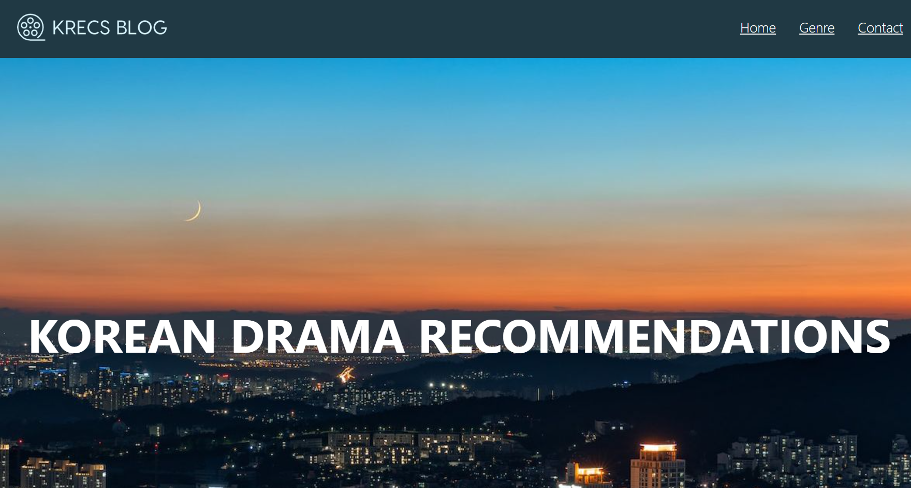
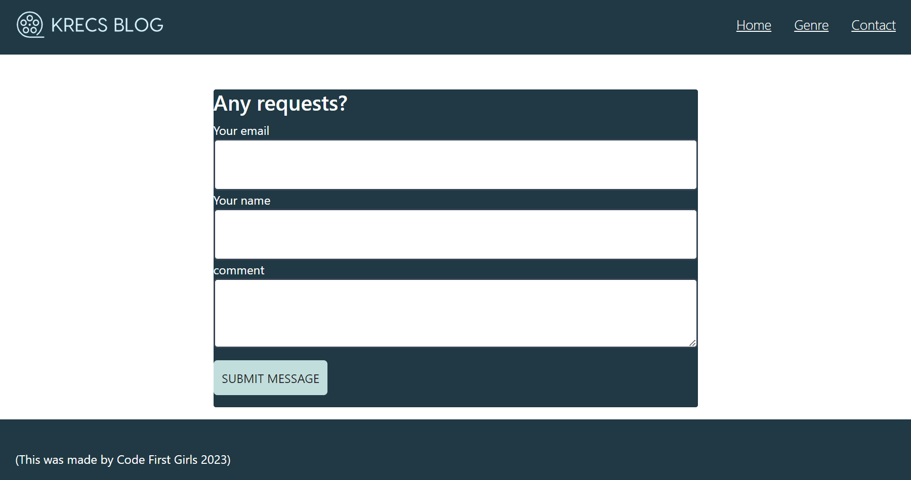
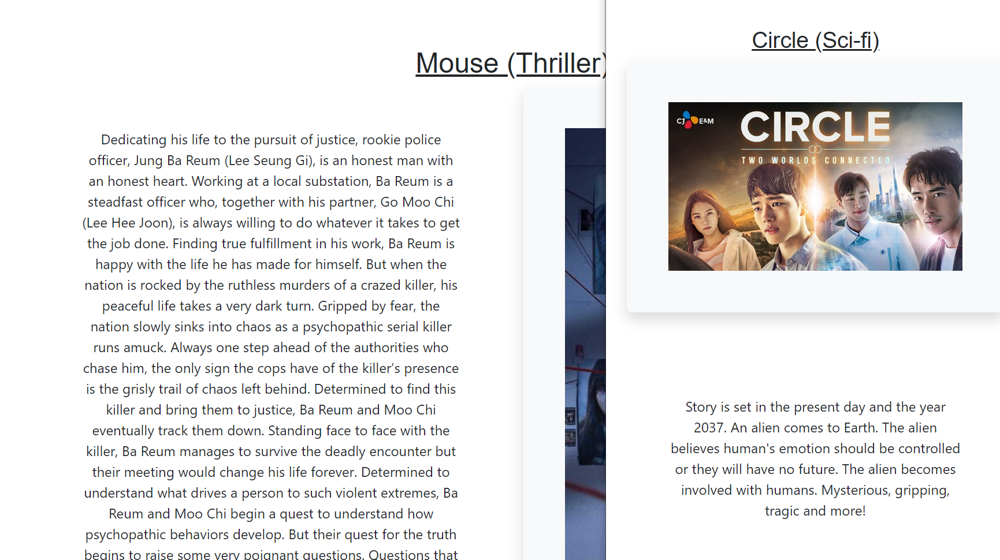

# ProjectKRecs

## Description
A korean drama reccomendation responsive website designed using css and html. 

## Usage
*The website was created using html and css.

*All pages consists of a navigation bar and footer. 

*The Homepage and Contact page both consists of contact form.

*It uses boostrap framework and is responsive for all devices from desktop to mobile view.

## Deployment
Url: https://sae9.github.io/ProjectKRecs/ 

